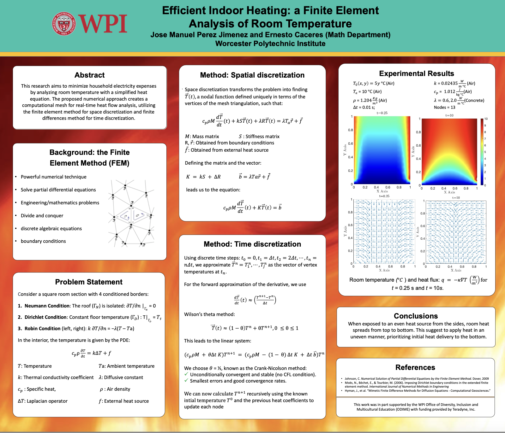

# Heat Flux Analysis using FEM and FDM

Welcome to the **Heat Flux Analysis** repository, a project developed by **Jose Manuel**, an undergraduate student at Worcester Polytechnic Institute (WPI). This work was completed during the Summer of 2023 as part of the **EREE program** at WPI, in collaboration with **Professor Caceres**.

## Project Overview

This project simulates heat flux in a square room section under various boundary conditions using the **Heat Equation**. Since the Heat Equation does not have an analytical solution, this simulation employs **MATLAB** to implement a finite element method (FEM) for space discretization and a finite differences method for time discretization. The project focuses on vectorization of matrices to ensure efficient computation, as detailed in the accompanying analysis PDF.

## Main Components

- **Triangular Mesher**: Generates the mesh for spatial discretization.
- **Recursive Equation Simulator**: Solves the Heat Equation using FEM and finite differences methods.
- **Boundary Condition Files**: Predefined boundary conditions available for the simulation.
- **Explanatory Poster**: Summarizes the key aspects of the project.
- **In-Depth Analysis Paper**: A research paper discussing the optimization of the finite differences method.

## Instructions to Run the Simulation

1. Open MATLAB.
2. Navigate to the project directory.
3. Run the following command, replacing `#subdivisions` with the desired number of subdivisions:
   ```
   Heat(#subdivisions)
   ```
   For example, to run the simulation with 12 subdivisions:
   ```
   Heat(12)
   ```

For more detailed information about the mathematical methodologies and results, please refer to the analysis PDF and research paper included in the repository.

For inquiries, contact me at **jjimenez1@wpi.edu**.


